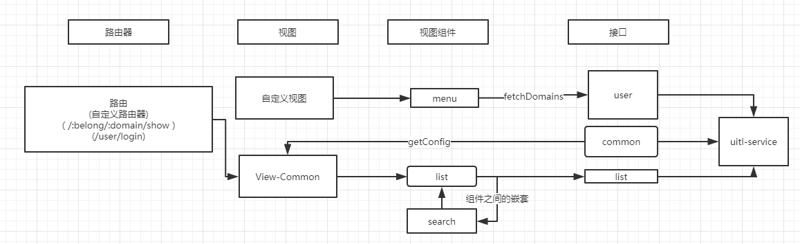

## admin-vue

### 概述
该项目为waiterphp-admin项目的前端源码部分。项目使用vue-webpack基本项目结构。提供一些基础业务代码，来实现后台的快速开发。基础代码并不影响项目本身的结构，故可在此基础上很灵活的实现二次开发。

### 基本结构
项目采用比较常用的结构划分，主要核心组件有:router(项目路由)、views（页面视图）、components（视图小组件）、api（服务器接口）。


### builder视图组件

##### builder的路由方案
##### list模块的配置格式
```json
[
    {
        "type":"list",
        "config": {
            "fields":[
                {"name":"id", "field":"id", "type":"int", "primaryKey":true, "fastEdit":false},
                {"name":"姓名", "field":"username", "primaryKey":false, "fastEdit":true},
                {"name":"性别", "field":"sex", "type":"enum", "enum":{"1":"男","2":"女"}}
            ],
            "search" : [
                {"field":"username", "search":"like"},
                {"field":"sex"}
            ],
            "publicActions":[
                {"name":"添加", "action":"page", "url":"", "isDisabled":false}
            ],
            "itemActions":[
                {"name":"编辑", "action":"page", "url":"", "isDisabled":false},
                {"name":"删除", "action":"ajax", "url":"", "isDisabled":false, "confirm":true},
                {"name":"详情", "action":"page", "url":"", "isDisabled":false}
            ],
            "checkbox":{},
            "paging":{}
        }
    }
]
```
##### list模块的接口


##### getList接口

##### totalNum接口

##### action接口